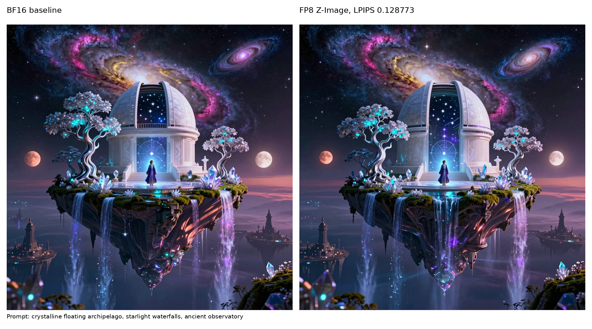

# FP8 Z-Image Quality Artifact

Generated by:

```bash
CUDA_VISIBLE_DEVICES=0 \
VLLM_OMNI_QUALITY_OUTPUT_DIR=$PWD/tests/diffusion/quantization/artifacts/fp8_z_image_quality \
.venv/bin/python -m pytest \
  tests/diffusion/quantization/test_quantization_quality.py::test_quantization_quality[fp8_z_image] \
  -s -v -m ""
```

Quantized config:

```python
{
    "method": "fp8",
    "ignored_layers": [
        "img_mlp",
        "layers.15..29.{attention.to_qkv,attention.to_out.0,feed_forward.w13,feed_forward.w2}",
        "model.layers.28..35.{self_attn.q_proj,self_attn.k_proj,self_attn.v_proj,self_attn.o_proj,"
        "mlp.gate_proj,mlp.up_proj,mlp.down_proj}",
    ],
}
```

Result: passed with `max_lpips=0.15`.

| Metric | Value |
|--------|-------|
| LPIPS | 0.128773 |
| PSNR | 20.125577 dB |
| MAE | 0.047712 |

This uses regular online FP8 quantization for the text encoder, with only the final
8 text-encoder blocks routed through `ignored_layers` for BF16 fallback.

## Comparison



## Individual Outputs


